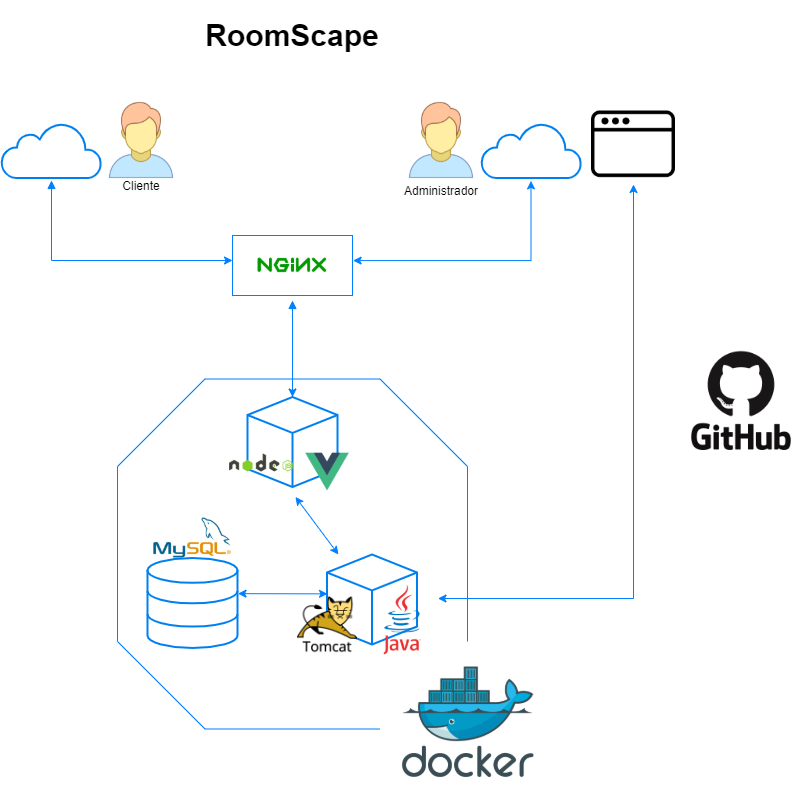

# RoomScape Prototipo (Front End)



Este proyecto es el Front-End del prototipo tecnológico a presentar para la asignatura de Gestión de Proyecto Software. Está desarrollado en Vue.js integrado con Bootstrap.

## Configuración del proyecto

```
npm install
```

### Comando para compilar y ejecutar la app en desarrollo

```
npm run serve
```

### Comando para compilar la app de producción

```
npm run build
```

### Comando para ejecutar linters

```
npm run lint
```

## Referencias

RoomScape Back End (Prototipo tecnológico): https://github.com/jmoyonero/roomscape-prototype-back

Vue.js: https://vuejs.org/

BootstrapVue: https://bootstrap-vue.org/